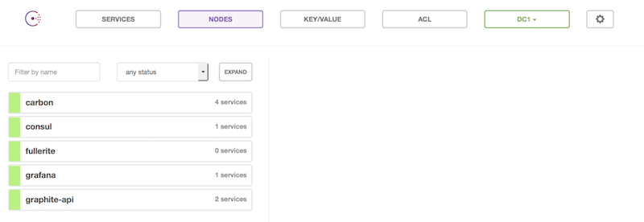
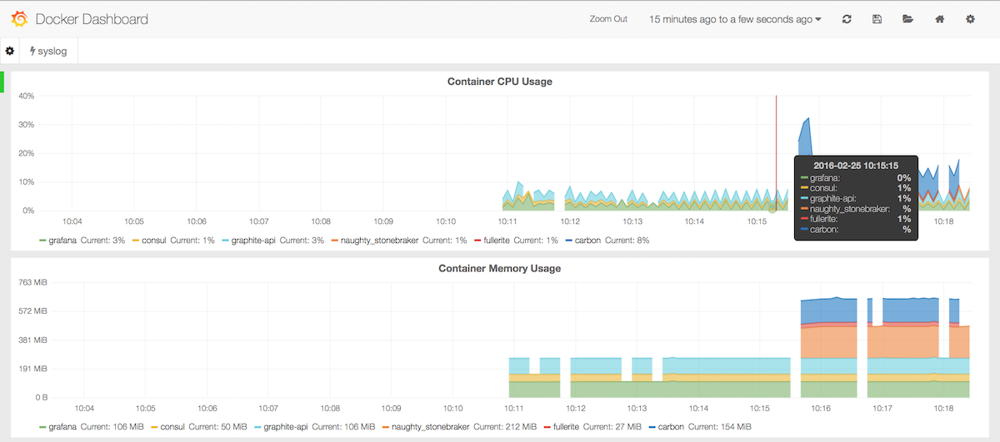
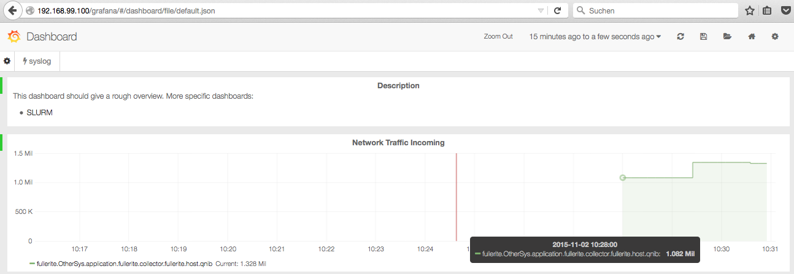

## Graphite Handler Stack

This example simply provides a target to push the graphite-metrics to.

### QNIBTerminal

It leverages the QNIBTerminal stacks, which are a playground to toy around with stacks.
One of which happens to be a graphite stack.

## StartUp

Install `docker` and `docker-compose` and fire up the `docker-compose.yml` file.

```
$ docker-compose up -d
Creating consul
Creating fullerite
Creating grafana
Creating carbon
Creating graphite-api
$ docker-compose ps
    Name                  Command               State           Ports
------------------------------------------------------------------------------
carbon         /opt/qnib/bin/start_superv ...   Up      0.0.0.0:2003->2003/tcp
consul         /opt/qnib/bin/start_superv ...   Up      0.0.0.0:8500->8500/tcp
fullerite      /opt/qnib/supervisor/bin/s ...   Up
grafana        /opt/qnib/bin/start_superv ...   Up      0.0.0.0:80->80/tcp
graphite-api   /opt/qnib/supervisor/bin/s ...   Up      0.0.0.0:8888->80/tcp
$
```

After some seconds the `Consul` dashboard (`<docker_host>:8500`) should report all services to be up'n'running, hence you can start.



Head over to the grafana dashboard to see the metrics (`<docker_host>:80`).



The metrics you see are collected via `DockerStats` on a `fullerite` container.

## Build Fullerite

Just build the fullerite daemons.

```
$ make
Cleaning fullerite...
Linting fullerite sources...
Getting dependencies...
Building fullerite...
Building beatit...
Testing fullerite
ok  	beatit	0.008s	coverage: 22.2% of statements
ok  	fullerite	0.009s	coverage: 18.2% of statements
ok  	fullerite/collector	0.121s	coverage: 89.8% of statements
ok  	fullerite/config	0.009s	coverage: 81.4% of statements
ok  	fullerite/handler	1.015s	coverage: 55.3% of statements
ok  	fullerite/internalserver	0.113s	coverage: 88.1% of statements
ok  	fullerite/metric	0.010s	coverage: 84.2% of statements
$
``` 

## Send Metrics

After building the binaries the daemon is started with the configuration provided by the example directory. *YMMV*: Please make sure that the `graphite-handler` holds the IP of your docker machine.

```
$ ./bin/fullerite --config examples/docker-host/fullerite.conf -l debug
INFO[02 Nov 15 10:29 CET] Starting fullerite...                         app=fullerite
INFO[02 Nov 15 10:29 CET] Reading configuration file at examples/docker-host/fullerite.conf  app=fullerite pkg=config
INFO[02 Nov 15 10:29 CET] Starting collectors...                        app=fullerite
DEBU[02 Nov 15 10:29 CET] Starting collector Diamond                    app=fullerite
DEBU[02 Nov 15 10:29 CET] Starting collector Fullerite                  app=fullerite
DEBU[02 Nov 15 10:29 CET] Starting collector Test                       app=fullerite
INFO[02 Nov 15 10:29 CET] Starting handlers...                          app=fullerite
INFO[02 Nov 15 10:29 CET] Starting handler Graphite                     app=fullerite
INFO[02 Nov 15 10:29 CET] Running DiamondCollector                      app=fullerite
INFO[02 Nov 15 10:29 CET] Starting to run internal metrics server on port 19090 on path /metrics  app=fullerite pkg=internalserver[
INFO[02 Nov 15 10:29 CET] Running FulleriteCollector                    app=fullerite
INFO[02 Nov 15 10:29 CET] Running TestCollector                         app=fullerite
DEBU[02 Nov 15 10:29 CET] {TestMetric gauge 0.6046602879796196 map[testing:yes]}  app=fullerite collector=Test pkg=collector
DEBU[02 Nov 15 10:29 CET] Graphite metric: {NumGoroutine counter 16 map[collector:fullerite]}  app=fullerite handler=Graphite pkg=handler
DEBU[02 Nov 15 10:29 CET] Graphite metric: {Alloc gauge 204840 map[collector:fullerite]}  app=fullerite handler=Graphite pkg=handler
DEBU[02 Nov 15 10:29 CET] Graphite metric: {TotalAlloc counter 204840 map[collector:fullerite]}  app=fullerite handler=Graphite pkg=handler
DEBU[02 Nov 15 10:29 CET] Graphite metric: {TestMetric gauge 0.6046602879796196 map[testing:yes]}  app=fullerite handler=Graphite pkg=handler
DEBU[02 Nov 15 10:29 CET] Graphite metric: {Sys gauge 4.983032e+06 map[collector:fullerite]}  app=fullerite handler=Graphite pkg=handler
DEBU[02 Nov 15 10:29 CET] Graphite metric: {Lookups counter 7 map[collector:fullerite]}  app=fullerite handler=Graphite pkg=handler
DEBU[02 Nov 15 10:29 CET] Graphite metric: {Mallocs counter 1307 map[collector:fullerite]}  app=fullerite handler=Graphite pkg=handler
DEBU[02 Nov 15 10:29 CET] Graphite metric: {Frees counter 0 map[collector:fullerite]}  app=fullerite handler=Graphite pkg=handler
DEBU[02 Nov 15 10:29 CET] Graphite metric: {HeapAlloc gauge 204840 map[collector:fullerite]}  app=fullerite handler=Graphite pkg=handler
DEBU[02 Nov 15 10:29 CET] Graphite metric: {HeapSys gauge 1.6384e+06 map[collector:fullerite]}  app=fullerite handler=Graphite pkg=handler
DEBU[02 Nov 15 10:29 CET] Graphite metric: {HeapIdle gauge 884736 map[collector:fullerite]}  app=fullerite handler=Graphite pkg=handler
DEBU[02 Nov 15 10:29 CET] Graphite metric: {HeapInuse gauge 753664 map[collector:fullerite]}  app=fullerite handler=Graphite pkg=handler
DEBU[02 Nov 15 10:29 CET] Graphite metric: {HeapReleased gauge 0 map[collector:fullerite]}  app=fullerite handler=Graphite pkg=handler
DEBU[02 Nov 15 10:29 CET] Graphite metric: {HeapObjects gauge 1307 map[collector:fullerite]}  app=fullerite handler=Graphite pkg=handler
DEBU[02 Nov 15 10:29 CET] Graphite metric: {StackInuse gauge 458752 map[collector:fullerite]}  app=fullerite handler=Graphite pkg=handler
DEBU[02 Nov 15 10:29 CET] Graphite metric: {StackSys gauge 458752 map[collector:fullerite]}  app=fullerite handler=Graphite pkg=handler
DEBU[02 Nov 15 10:29 CET] Graphite metric: {MSpanInuse gauge 10080 map[collector:fullerite]}  app=fullerite handler=Graphite pkg=handler
DEBU[02 Nov 15 10:29 CET] Graphite metric: {MSpanSys gauge 16384 map[collector:fullerite]}  app=fullerite handler=Graphite pkg=handler
DEBU[02 Nov 15 10:29 CET] Graphite metric: {MCacheInuse gauge 4832 map[collector:fullerite]}  app=fullerite handler=Graphite pkg=handler
DEBU[02 Nov 15 10:29 CET] Graphite metric: {MCacheSys gauge 16384 map[collector:fullerite]}  app=fullerite handler=Graphite pkg=handler
DEBU[02 Nov 15 10:29 CET] Graphite metric: {BuckHashSys gauge 1.443122e+06 map[collector:fullerite]}  app=fullerite handler=Graphite pkg=handler
DEBU[02 Nov 15 10:29 CET] Graphite metric: {GCSys gauge 65536 map[collector:fullerite]}  app=fullerite handler=Graphite pkg=handler
DEBU[02 Nov 15 10:29 CET] Graphite metric: {OtherSys gauge 1.344454e+06 map[collector:fullerite]}  app=fullerite handler=Graphite pkg=handler
DEBU[02 Nov 15 10:29 CET] Graphite metric: {NextGC gauge 4.194304e+06 map[collector:fullerite]}  app=fullerite handler=Graphite pkg=handler
DEBU[02 Nov 15 10:29 CET] Graphite metric: {LastGC gauge 0 map[collector:fullerite]}  app=fullerite handler=Graphite pkg=handler
DEBU[02 Nov 15 10:29 CET] Graphite metric: {PauseTotalNs counter 0 map[collector:fullerite]}  app=fullerite handler=Graphite pkg=handler
DEBU[02 Nov 15 10:29 CET] Graphite metric: {NumGC counter 0 map[collector:fullerite]}  app=fullerite handler=Graphite pkg=handler
```

# To be continued...

All is left is to play around with grafana to display the metrics.




